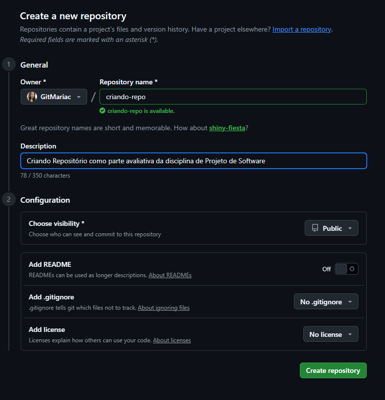
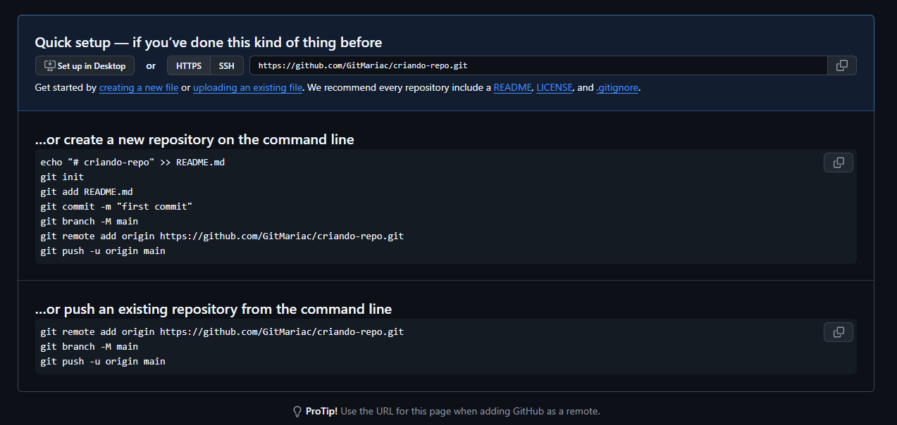
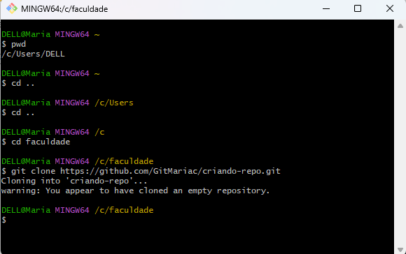
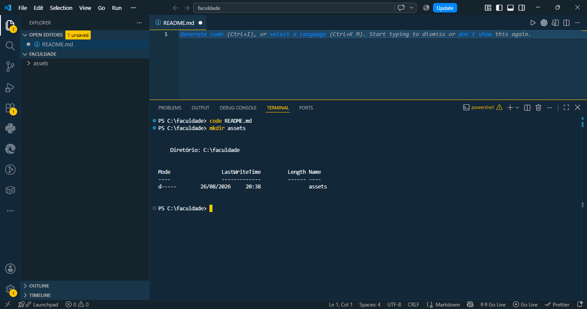
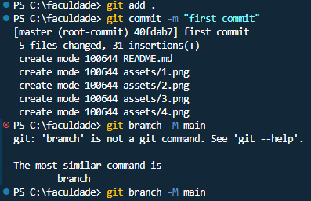
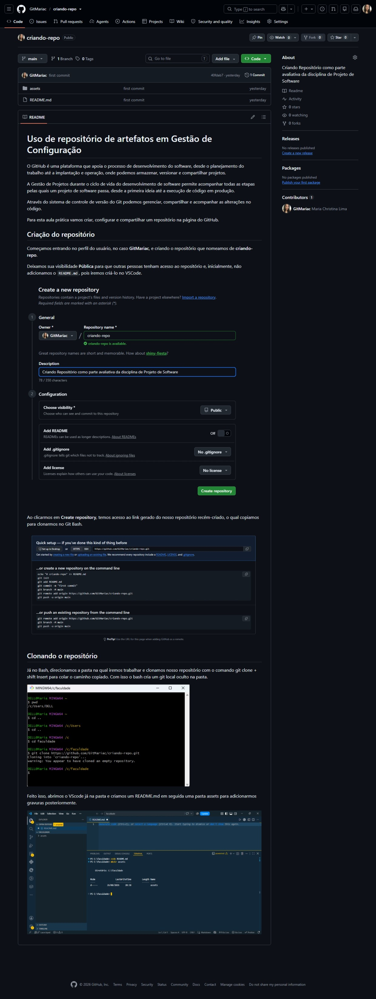
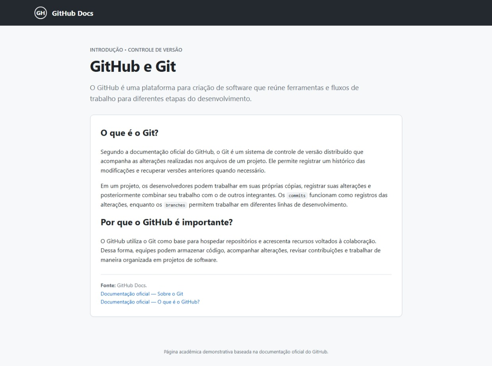

# Uso de repositório de artefatos em Gestão de Configuração

O GitHub é uma plataforma que apoia o processo de desenvolvimento do software, desde o planejamento do trabalho até a implantação e operação, onde podemos armazenar, versionar e compartilhar projetos.

A Gestão de Projetos durante o ciclo de vida do desenvolvimento de software permite acompanhar todas as etapas pelas quais um projeto de software passa, desde a primeira ideia até a execução de código em produção.

Através do sistema de controle de versão do Git podemos gerenciar, compartilhar e acompanhar as alterações no código.

Para esta aula prática vamos criar, configurar e compartilhar um repositório na página do GitHub.

## Criação do repositório

Começamos entrando no perfil do usuário, no caso **GitMariac**, e criando o repositório que nomeamos de **criando-repo**.

Deixamos sua visibilidade **Pública** para que outras pessoas tenham acesso ao repositório e, inicialmente, não adicionamos o `README.md`, pois iremos criá-lo no VSCode.

Ao clicarmos em **Create repository**, temos acesso ao link gerado do nosso repositório recém-criado, o qual copiamos para clonarmos no Git Bash.

## Clonando o repositório

Já no Bash, direcionamos a pasta na qual iremos trabalhar e clonamos nosso repositório com o comando git clone + shift Insert para colar o caminho copiado. Com isso o bash cria um git local oculto na pasta.  

Feito isso, abrimos o VScode já na pasta e criamos um README.md em seguida uma pasta assets para adicionarmos gravuras posteriormente.

Feito isso podemos já abrir nossa página do GitHub e conferir as alterações feitas no nosso repositório, tanto a criação do README.me quanto a pasta com as imagens. 

Observe que foi digitado o comando de branch errado (bramch), mas isso não interfere no nosso processo pois o comando não é reconhecido logo não é realizado nenhuma ação. 

Feito isso podemos já abrir nossa página do GitHub e conferir as alterações feitas no nosso repositório, tanto a criação do README.me quanto a pasta com as imagens. 

Para fins didáticos ainda criamos uma pequena página HTML utilizando uma ferramenta IA (ChatGPT) para adicionarmos a nosso repositório e realizamos alterações e novos commits durante este processo.

## Considerações finais

Dado tais pressupostos e seguindo as norteações do enunciado desta aula prática, entendemos que as competências desenvolvidas com o uso de ferramentas de gestão de configuração contribuem diretamente para a confiabilidade das tarefas realizadas por uma equipe de desenvolvimento de software. De acordo com a documentação do próprio GitHub, o seu sistemas de controle de versão registram o histórico das alterações, permitindo identificar quais mudanças foram realizadas, por quem e quando. Dessa forma, o uso de repositórios, commits e branches proporcionam maior organização, rastreabilidade e segurança durante o desenvolvimento, além de facilitar a colaboração entre os integrantes da equipe. 

Em ambientes reais, a utilização de uma ferramenta de gestão de configuração é importante porque diversos profissionais podem trabalhar simultaneamente no mesmo projeto, tornando necessário controlar e documentar as alterações realizadas. O GitHub possibilita o uso de pull requests para propor, discutir e revisar mudanças antes que sejam incorporadas ao projeto principal, ajudando a identificar problemas antecipadamente e manter a qualidade do código. Assim, a gestão de configuração reduz riscos, facilita a recuperação de versões anteriores e proporciona maior controle sobre os artefatos produzidos durante o desenvolvimento de software.

## Referência Bibliográfica

GIT. Git Documentation. Git, [s. d.]. Disponível em: https://git-scm.com/docs/git/pt_BR.html. Acesso em: 13 set. 2026.